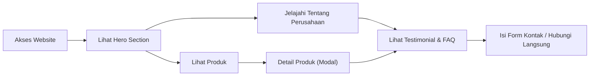

## 1. Product Overview
Website profesional untuk penjualan EcoFire - Premium Coconut Charcoal Briquettes, dirancang untuk pasar ekspor internasional dengan desain premium dan modern.
- Menyediakan informasi produk lengkap, proses produksi, dan kontak bisnis yang meyakinkan calon pembeli luar negeri.
- Meningkatkan kredibilitas perusahaan dan memperluas jangkauan pasar global.

## 2. Core Features

### 2.1 User Roles
Tidak ada peran pengguna khusus, website dapat diakses oleh semua calon pembeli dan pengunjung umum.

### 2.2 Feature Module
1. **Home**: Hero section fullscreen, navbar sticky, about, products, why choose, gallery, testimonials, FAQ, contact
2. **About**: Sejarah perusahaan, statistik, gambar pabrik
3. **Products**: Grid produk, modal detail produk
4. **Export**: Peta negara tujuan ekspor
5. **Contact**: Form kontak, informasi kontak lengkap

### 2.3 Page Details
| Page Name | Module Name | Feature description |
|-----------|-------------|---------------------|
| Home | Navbar | Sticky navbar, transparan saat di atas, berubah hitam saat discroll |
| Home | Hero Section | Fullscreen, background video/gambar bara api, overlay gelap, animasi fade dan parallax |
| Home | About EcoFire | Deskripsi perusahaan, gambar pabrik, statistik (Export Countries, Production Capacity, Years Experience, Happy Clients) |
| Home | Why Choose EcoFire | Card modern dengan icon besar, efek hover, 6 fitur utama |
| Home | Products | Grid responsive, 6 produk, tombol detail |
| Home | Product Detail Modal | Popup modern dengan gallery produk, spesifikasi lengkap |
| Home | Export Countries | Peta dunia dengan marker negara tujuan ekspor |
| Home | Gallery | Masonry grid, hover zoom, lightbox |
| Home | Production Process | Timeline horizontal 8 tahapan |
| Home | Testimonials | Slider otomatis, card modern, rating bintang |
| Home | FAQ | Accordion modern, 6 pertanyaan umum |
| Home | Contact | Form kontak, Google Maps, informasi kontak |
| Home | Footer | Logo, quick links, products, contact, social media, copyright |

## 3. Core Process
Pengunjung mengakses website → melihat hero section → menjelajahi informasi produk dan perusahaan → melihat detail produk → mengisi form kontak atau menghubungi via WhatsApp/email.

## 4. User Interface Design

### 4.1 Design Style
- Primary Colors: #0F0F0F (Background), #1C1C1C (Secondary), #FF6B00 (Orange Fire), #D4A017 (Gold), #FFFFFF (White), #BFBFBF (Gray)
- Button Style: Rounded, dengan efek hover glow orange
- Font: Poppins Bold (Heading), Inter (Body)
- Layout Style: Card-based, dengan section yang terpisah dan jelas
- Icon Style: Modern, minimalis, dengan warna sesuai tema

### 4.2 Page Design Overview
| Page Name | Module Name | UI Elements |
|-----------|-------------|-------------|
| Home | Navbar | Sticky, transparan → hitam saat scroll, logo EcoFire, menu navigasi, tombol Get Quote |
| Home | Hero Section | Fullscreen height, background video/gambar bara api dengan overlay gelap, judul besar, deskripsi, 2 tombol (Contact Us, Download Catalogue), animasi fade dan parallax |
| Home | About EcoFire | Layout 2 kolom, teks + gambar pabrik, 4 kotak statistik dengan animasi count up |
| Home | Why Choose EcoFire | Grid 2/3 kolom, card dengan icon besar, efek hover lift dan glow |
| Home | Products | Grid responsive 2-3-4 kolom, setiap card memiliki gambar, nama, spesifikasi, tombol Detail |
| Home | Product Detail Modal | Popup dengan animation slide up, gallery gambar, spesifikasi lengkap dalam tabel |
| Home | Export Countries | Peta dunia interaktif dengan marker pada negara tujuan ekspor |
| Home | Gallery | Masonry grid gambar, efek hover zoom, lightbox saat diklik |
| Home | Production Process | Timeline horizontal dengan icon dan deskripsi setiap tahap |
| Home | Testimonials | Slider otomatis dengan card testimonial, rating bintang, nama dan negara |
| Home | FAQ | Accordion dengan animasi smooth, pertanyaan dan jawaban |
| Home | Contact | Layout 2 kolom: form kontak di kiri, Google Maps + info kontak di kanan |
| Home | Footer | Logo, quick links, produk, kontak, social media, copyright |

### 4.3 Responsiveness
- Mobile First, fully responsive
- Perfect display on: 320px, 375px, 425px, 768px, 1024px, 1280px, 1440px, 1920px
- No horizontal overflow
- Touch optimization for mobile devices
- Lazy loading images

### 4.4 Animation
- Framer Motion untuk semua animasi
- Animasi fade in saat scroll ke setiap section
- Hover effects yang elegan
- Smooth scroll
- Parallax effect pada hero section
- Slider otomatis untuk testimonials
