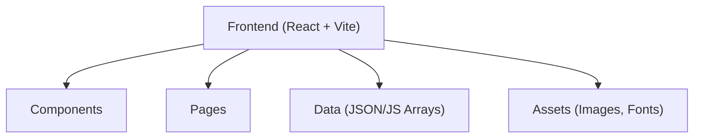

## 1. Architecture Design



## 2. Technology Description

- **Frontend**: React@18 + Tailwind CSS@3 + Vite
- **Initialization Tool**: Vite (npm create vite@latest)
- **Backend**: None (no backend required)
- **Database**: None, all data stored in JSON/JavaScript arrays
- **Animation Library**: Framer Motion
- **Routing**: React Router
- **Icons**: React Icons
- **Slider**: SwiperJS
- **Deployment**: GitHub Pages / Vercel

## 3. Route Definitions

| Route | Purpose |
|-------|---------|
| / | Home page dengan semua section |

## 4. API Definitions
Tidak ada API backend, semua data disimpan secara lokal dalam file JavaScript/JSON.

## 5. Server Architecture Diagram
Tidak ada server backend.

## 6. Data Model

### 6.1 Data Model Definition
Tidak ada database, data disimpan dalam array JavaScript.

### 6.2 Data Structures
Berikut adalah struktur data yang akan digunakan:

```javascript
// Products data
const products = [
  {
    id: 1,
    name: "Shisha Briquettes",
    image: "/assets/images/products/shisha.jpg",
    specification: "Hexagonal shape, 25mm diameter",
    burningTime: "4-6 hours",
    moisture: "&lt;5%",
    ashContent: "&lt;3%",
    calorificValue: "7000+ kcal/kg",
    packing: "10kg/carton",
    gallery: ["/assets/images/products/shisha-1.jpg", "/assets/images/products/shisha-2.jpg"]
  }
];

// Testimonials data
const testimonials = [
  {
    id: 1,
    name: "Ahmed Ali",
    country: "UAE",
    rating: 5,
    comment: "Excellent quality charcoal briquettes!",
    avatar: "/assets/images/testimonials/ahmed.jpg"
  }
];

// FAQ data
const faqs = [
  {
    id: 1,
    question: "What is the MOQ?",
    answer: "Our Minimum Order Quantity is 1x20' container."
  }
];
```

## 7. Project Structure

```
src/
  assets/
    images/
      products/
      gallery/
      testimonials/
  components/
    Navbar.jsx
    Hero.jsx
    About.jsx
    WhyChoose.jsx
    Products.jsx
    ProductModal.jsx
    ExportCountries.jsx
    Gallery.jsx
    ProductionProcess.jsx
    Testimonials.jsx
    FAQ.jsx
    Contact.jsx
    Footer.jsx
  pages/
    Home.jsx
  layouts/
    MainLayout.jsx
  data/
    products.js
    testimonials.js
    faqs.js
  hooks/
    useScrollAnimation.js
  utils/
    constants.js
  App.jsx
  main.jsx
index.html
package.json
vite.config.js
tailwind.config.js
```
